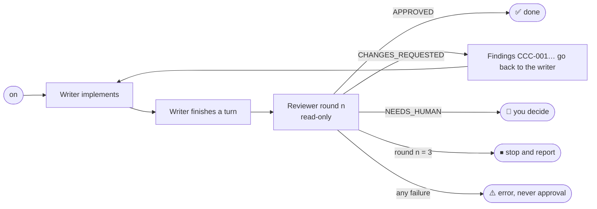

<div align="center">


# CCC Review

**Claude Code ↔ Codex Review**

Use Claude Code to implement and Codex to review,
or Codex to implement and Claude Code to review.

[](https://github.com/hlavacm/ccc-review/actions/workflows/ci.yml)
[](CHANGELOG.md)
[](LICENSE)
[](#requirements)
[](#claude-code-claude-writes-codex-reviews)
[](#codex-codex-writes-claude-code-reviews)

[Quick start](#quick-start) ·
[How it works](#how-it-works) ·
[Install](#install) ·
[Usage](#usage) ·
[Configuration](#configuration) ·
[Security](#security-and-privacy) ·
[Testing](#testing)

</div>

---

A second, independent model catches the bugs the first one talked itself
past. Doing that by hand means copying the task, the diff and the writer's
report to the other agent and pasting its findings back. **CCC Review automates
that loop inside the agent you already use**: when the writer finishes a
turn, the other agent reviews the real repository changes, and its findings
go back to the writer until the reviewer approves or a bounded stop
condition is reached.

## Highlights

- 🔁 **Both directions**: Claude Code writes and Codex reviews, or the other
  way around, with the same loop and the same guarantees.
- 🧭 **Bounded**: one review round per completion, at most 3 rounds by
  default, no runaway loops.
- 🔒 **Read-only reviewer**: Codex runs in its read-only sandbox, Claude gets
  only Read/Grep/Glob. No commits, stashes, resets or pushes, ever.
- 🚫 **Failure is never approval**: a missing binary, expired login, timeout
  or malformed output stops the review with an error.
- 🎯 **Opt-in per session**: nothing happens until you run `on`.
- 🪶 **Zero runtime dependencies**: the hooks run the TypeScript sources on
  Node.js directly; no `npm install`, no build.

## Quick start

**Claude Code writes, Codex reviews**

1. Install the plugin and restart Claude Code:

   ```sh
   claude plugin marketplace add hlavacm/ccc-review
   claude plugin install ccc-review@hlavacm
   ```

2. Turn review on: `/ccc-review:on Add multiply(a, b) to math.js with a test`.
   This only arms review and records the task for the reviewer; Claude does
   not start working.
3. Ask Claude for the work in a normal message, for example
   `Add multiply(a, b) to math.js with a test.` Codex reviews every time
   Claude finishes.

**Codex writes, Claude Code reviews**

1. Install the plugin, start Codex and approve the CCC Review hooks in `/hooks`:

   ```sh
   codex plugin marketplace add hlavacm/ccc-review
   codex plugin add ccc-review@hlavacm
   ```

2. Turn review on: `$ccc-review on Fix add() in math.js and add a test`. This only
   arms review and records the task for the reviewer; Codex does not start
   working.
3. Ask Codex for the work in a normal message, for example
   `Fix add() in math.js and add a test.` Claude reviews every time Codex
   finishes.

## How it works



| | Claude Code → Codex | Codex → Claude Code |
| --- | --- | --- |
| **Writer** (you work with it) | Claude Code | Codex |
| **Reviewer** (headless, read-only) | `codex exec --sandbox read-only` | `claude -p --tools Read,Grep,Glob` |
| **Command** | `/ccc-review:on`, `/ccc-review:current`, `/ccc-review:off`, `/ccc-review:status` | `$ccc-review on\|current\|off\|status` |
| **Trigger** | Claude Code `Stop` hook | Codex `Stop` hook |

- **Writer**: plans, implements, and evaluates each finding: it fixes valid
  ones and rejects invalid ones with reasoning. Reviewer feedback is advisory.
- **Reviewer**: returns a structured verdict (`APPROVED`,
  `CHANGES_REQUESTED` or `NEEDS_HUMAN`) plus findings with stable IDs
  (`CCC-001`, `CCC-002`, …) that stay the same across rounds.
- **Git is the source of truth**: at `on`, CCC Review records the repository root,
  `HEAD`, branch and `git status`. The reviewer sees everything since that
  `HEAD`, commits included, and is told that files dirty before `on` may not
  be the writer's.

Review runs only in sessions where you turned it on. Hook messages are
prefixed `CCC Review`.

## Requirements

- macOS or Linux, Git, and Node.js ≥ 24 on `PATH`.
- **Claude writes, Codex reviews**: Claude Code with plugin support, and the
  Codex CLI authenticated with `codex login` (or `CODEX_API_KEY`).
- **Codex writes, Claude reviews**: the Codex CLI with plugin hooks, and
  Claude Code authenticated with `claude auth login` (or `ANTHROPIC_API_KEY`).

`on` checks that the reviewer CLI exists and is logged in
(`codex login status` / `claude auth status`, or only `--version` with an API
key) and refuses to enable review otherwise.

Developed with Claude Code 2.1.278, codex-cli 0.155.1 and Node.js 26; CI runs
the test suite on Node.js 24.

## Install

The repository is both a Claude Code plugin (`.claude-plugin/`) and a Codex
plugin (`.codex-plugin/`), and it ships a marketplace named `hlavacm` that
both CLIs read.

### Claude Code (Claude writes, Codex reviews)

```sh
claude plugin marketplace add hlavacm/ccc-review
claude plugin install ccc-review@hlavacm
```

Restart Claude Code. Inside Claude Code, `/plugin marketplace add …` and
`/plugin install ccc-review@hlavacm` work too. To try it for one session without
installing, clone the repository and run `claude --plugin-dir <clone>`.

### Codex (Codex writes, Claude Code reviews)

```sh
codex plugin marketplace add hlavacm/ccc-review
codex plugin add ccc-review@hlavacm
```

Codex runs plugin hooks only after you trust them: start Codex, open `/hooks`
and approve the CCC Review `UserPromptSubmit` and `Stop` hooks. Do it again after
every update that changes them.

<details>
<summary><b>Install from a local clone instead</b></summary>

```sh
git clone https://github.com/hlavacm/ccc-review ~/.local/share/ccc-review
claude plugin marketplace add ~/.local/share/ccc-review
codex plugin marketplace add ~/.local/share/ccc-review
```

Then install `ccc-review@hlavacm` as above. A local-path marketplace installs a
copy of the whole directory, untracked files included, so use a clean clone,
not a development checkout with `node_modules/` or `dist/`.

</details>

## Usage

### Claude → Codex

Claude Code names a plugin command `/<plugin>:<command>`, so there is one
command per action:

```text
/ccc-review:on [task description]   # check Codex, record Git baseline, arm review (does not start Claude)
/ccc-review:current [note]          # one-off audit of the uncommitted changes, after the work (see below)
/ccc-review:status                  # state, round n/3, reviewer settings, history, file paths
/ccc-review:off                     # disarm (also stops further rounds of this task)
```

```text
> /ccc-review:on Add multiply(a, b) to math.js with a test
CCC Review: enabled. Codex will review when Claude finishes.

> Add multiply(a, b) to math.js with a test.
… Claude edits math.js and finishes …
Stop hook: CCC Review round 1/3: Codex requested changes.
Findings:
- CCC-001 [high] math.js:2: multiply returns a + b instead of a * b
… Claude: "CCC-001: fixed — … Verification: node --test" …
CCC Review: Codex APPROVED (round 2/3). multiply is correct and tested.
```

To abort a running review, interrupt Claude (Esc). CCC Review kills the whole Codex
process group, records the round as `reviewer_error` (not approved) and stops
the task. `/ccc-review:on` starts a fresh one.

### Codex → Claude

Codex has no plugin slash commands, so the command is the `$ccc-review` skill
mention. The `UserPromptSubmit` hook handles it and blocks it, so it never
reaches the model. `$ccc-review:ccc-review …` works too.

```text
$ccc-review on [task description]   # check Claude, record Git baseline, arm review (does not start Codex)
$ccc-review current [note]          # one-off audit of the uncommitted changes, after the work (see below)
$ccc-review status                  # state, round n/3, reviewer settings, history
$ccc-review off                     # disarm
```

```text
> $ccc-review on Fix add() in math.js and add a node:test test
CCC Review: enabled. Claude will review when Codex finishes.

> Fix add() in math.js and add a node:test test.
… Codex edits math.js and finishes; the Stop hook runs Claude …
CCC Review round 1/3: Claude requested changes. (Codex continues with the findings)
… Codex: "CCC-001: fixed …" …
CCC Review: Claude APPROVED (round 2/3).
```

### Audit after the work: `current`

`on` has to be armed before the writer starts. When the work is already done
and you want a second opinion on it, use `current`:

```text
… Claude planned and implemented something; nothing is committed yet …
> /ccc-review:current please check the error handling
… Claude writes the task, its plan and its report for the reviewer and finishes …
CCC Review audit: Codex requested changes.
- CCC-001 [high] api.ts:41: …
… Claude presents the findings with its own assessment and changes nothing …
```

- The command is not blocked like the others: its skill asks the writer to
  write down the task, its plan and its report, because only the writer knows
  them. That message and the real Git changes go to the reviewer. This is also
  the only way the writer's plan reaches the reviewer.
- It reviews the uncommitted changes only (staged, unstaged, untracked) and
  treats all of them as the writer's work. Committed work is not audited;
  with a clean tree the command is refused.
- One round, no loop: the findings come back once, the writer shows them and
  changes nothing, and you decide what to fix. Run `current` again for another
  opinion after fixing.
- It is refused while `on` is active in the session. A reviewer failure is an
  error, never approval.

### Rounds, stop conditions and errors

- Every writer completion while review is on runs exactly one round. A
  duplicate or concurrent completion event never starts a second one.
- After round 3 (`CCC_REVIEW_MAX_ROUNDS`) without approval, review stops and you get
  the last findings. The writer is not blocked again.
- A missing reviewer binary, failed login, non-zero exit, timeout, invalid
  JSON or an invalid review is an error: the round is recorded as
  `reviewer_error`, review stops, and you get a `CCC Review error` message.
  It is never treated as approval.
- `status` shows the round, last verdict, history, and where the state is.

## Configuration

Environment variables for the process that runs the writer: for Claude Code,
for example, the `env` block of `~/.claude/settings.json`; for Codex, the shell
that starts `codex`. Invalid values are reported as a `CCC Review error` and
never approve.

| Variable | Default | Direction |
| --- | --- | --- |
| `CCC_REVIEW_MAX_ROUNDS` | `3` (read at `on`) | both |
| `CCC_REVIEW_STATE_DIR` | Claude Code: `${CLAUDE_PLUGIN_DATA}`, Codex: `${PLUGIN_DATA}`, else `~/.ccc-review` | both |
| `CCC_REVIEW_CODEX_BIN` | `codex` | Claude → Codex |
| `CCC_REVIEW_CODEX_TIMEOUT_MS` | `1200000` (20 min; the Stop hook allows 30) | Claude → Codex |
| `CCC_REVIEW_CODEX_MODEL` | Codex's configured model (`-m`) | Claude → Codex |
| `CCC_REVIEW_CODEX_REASONING_EFFORT` | Codex's configured effort; `minimal`, `low`, `medium`, `high`, `xhigh` | Claude → Codex |
| `CCC_REVIEW_CLAUDE_BIN` | `claude` | Codex → Claude |
| `CCC_REVIEW_CLAUDE_TIMEOUT_MS` | `1200000` (20 min; the Stop hook allows 30) | Codex → Claude |
| `CCC_REVIEW_CLAUDE_MODEL` | Claude Code's configured model (`--model`) | Codex → Claude |
| `CCC_REVIEW_CLAUDE_EFFORT` | Claude Code's default; `low`, `medium`, `high`, `xhigh`, `max` | Codex → Claude |

```json
{ "env": { "CCC_REVIEW_MAX_ROUNDS": "2", "CCC_REVIEW_CODEX_REASONING_EFFORT": "high" } }
```

<details>
<summary><b>State files</b></summary>

- `tasks/<taskId>.json`: round, verdict, baseline.
- `history/<taskId>.jsonl`: append-only log of `on`, each round, errors and
  `off`.
- `sessions/<sessionId>.json`: task id and recorded prompts.
- `claims/<taskId>/<hash>`: completions already reviewed, removed when the
  task ends.

</details>

<details>
<summary><b>Exact reviewer invocations</b></summary>

Both reviewers are spawned as executable + argument list with the prompt on
stdin, in their own process group with their own deadline.

```text
codex exec --sandbox read-only -c approval_policy="never" [-c model_reasoning_effort="…"] [-m <model>] \
  --cd <repo root> --ephemeral --color never --output-schema <strict schema> --output-last-message <file> -

claude -p --safe-mode --no-session-persistence --output-format json --json-schema <schema> \
  --tools Read,Grep,Glob --permission-mode dontAsk --permission-prompts none [--model M] [--effort E]
```

`--safe-mode` loads no CLAUDE.md, plugins, hooks or MCP servers, so the
nested Claude cannot re-enter CCC Review's own hooks. Claude has no shell, so CCC Review
collects the Git changes itself (read-only `git log`, the changed-file list,
`git diff --no-ext-diff --no-textconv` and untracked files) and puts them in
the prompt.

</details>

## Security and privacy

What the reviewer receives, and therefore what is sent to its model provider
(OpenAI for Codex, Anthropic for Claude Code):

- **the original task**: the text after `on` and your prompts while review is
  on (last 12 000 characters);
- **the implementation plan**: neither host makes it available to CCC Review, so it
  is not sent;
- **the writer's implementation report**: its final message (last 12 000
  characters);
- **Git metadata**: repository root, branch, activation `HEAD`, and paths
  that were dirty before `on` (up to 50);
- **the changes and any repository content the reviewer reads**: Codex runs
  `git diff`/`git log` and reads files itself; Claude gets `git log`, the
  changed-file list, the diff (up to 200 000 characters) and untracked files
  in the prompt, and reads other files with its Read/Grep/Glob tools;
- **previous findings** and verdicts of the same task.

Guarantees:

- The reviewer is read-only for source code: Codex runs in
  `--sandbox read-only` with `approval_policy="never"`, and Claude has no
  shell, no edit tools and no plugins, hooks or MCP servers.
- CCC Review does not commit, stash, reset, check out, rebase or push.
- Processes are spawned as executable + argument list, never via a shell
  string, and prompts go on stdin.
- A reviewer failure is never approval.
- State stays outside the repository (see `CCC_REVIEW_STATE_DIR`). Nothing is sent
  anywhere except to the reviewer CLI you configured.

What read-only does not mean:

- **Codex can read outside the repository.** Its read-only sandbox blocks
  writes and network access, not reads: the Codex reviewer can read any file
  your user account can read, and may quote it in a finding. The Claude
  reviewer has file tools only (Read/Grep/Glob, nothing it is not
  pre-approved for) and no shell.
- **Secrets in changed files are sent.** A credential in a changed tracked
  file is part of the diff and goes to the reviewer's model provider. Do not
  enable review on changes you would not paste into a chat with that provider.
- **State is stored unencrypted.** Your recorded prompts and the reviewer's
  findings are kept as plain files in the state directory (its directories are
  kept at mode `0700`) until you delete them.

## Upgrade

**Claude Code** caches an installed plugin by version, so an update arrives
when a new version is released:

```sh
claude plugin marketplace update hlavacm
claude plugin update ccc-review@hlavacm
```

Restart Claude Code afterwards. To pick up changes without a version bump
(from a local clone), uninstall and install again.

**Codex** copies the plugin again on every `add`:

```sh
codex plugin marketplace upgrade hlavacm
codex plugin add ccc-review@hlavacm
```

For a local clone, `git pull` first and skip `marketplace upgrade`. Then
review the changed hooks again in `/hooks`.

## Uninstall

First run `/ccc-review:off` or `$ccc-review off` in active sessions. The state
directory is `CCC_REVIEW_STATE_DIR` if you set it, otherwise the plugin data
directory (`${CLAUDE_PLUGIN_DATA}` for Claude Code, `${PLUGIN_DATA}` for Codex), otherwise
`~/.ccc-review`; `status` of an enabled task prints the exact paths.

```sh
claude plugin uninstall ccc-review@hlavacm
claude plugin marketplace remove hlavacm
codex plugin remove ccc-review@hlavacm
codex plugin marketplace remove hlavacm
```

Then delete the state directory that `status` showed (`~/.ccc-review` or the plugin
data directory, unless you set `CCC_REVIEW_STATE_DIR`).

<details>
<summary><b>Troubleshooting</b></summary>

| Message | Fix |
| --- | --- |
| `codex executable not found: codex — install the Codex CLI or set CCC_REVIEW_CODEX_BIN` | install Codex or point `CCC_REVIEW_CODEX_BIN` at it (same for `claude` / `CCC_REVIEW_CLAUDE_BIN`) |
| `Codex is not logged in — run \`codex login\`` | `codex login` or `CODEX_API_KEY`; for Claude, `claude auth login` or `ANTHROPIC_API_KEY` |
| `… timed out after 20 min — raise CCC_REVIEW_CODEX_TIMEOUT_MS …` | raise the timeout, but keep it under the Stop hook's 30 min |
| `… returned invalid JSON: …` / `an invalid review: …` | usually transient; the excerpt shows what the reviewer produced |
| `… exited with code N: <last stderr lines>` | read the stderr lines; auth errors add the login hint |
| `CCC Review error: corrupt state file …` (or another unreadable-state error) on every prompt | run the command with `on` to start a fresh task or `off` to reset the session |
| `$ccc-review on` does nothing in Codex | the hooks are not trusted yet: open `/hooks` |

</details>

## Known limitations

- Windows is not supported (POSIX process groups and `/dev/null`); WSL works.
- The implementation plan is not passed to the reviewer, because neither host
  exposes a documented, stable way to read it.
- A completion is identified by its final message (in Codex, `turn_id` plus
  final message), so an identical completion delivered again is not reviewed
  twice.
- Files dirty before `on` are listed for the reviewer but not attributed line
  by line.
- Claude Code does not document the `command_name` a hook gets for a plugin
  skill. Claude Code 2.1.278 sends `ccc-review:on` (and nothing for built-in
  commands such as `/status`), and that is what the hook accepts; if a later
  version changes it, the skill tells you that review was NOT enabled.
- Codex does not document whether the TUI delivers a skill mention as the
  literal `$ccc-review`. If the hook does not handle it, the `ccc-review` skill tells you
  that review was NOT enabled.
- An armed `$ccc-review current` relies on Codex loading the skill text for the
  mention; that was not exercised in the real Codex TUI.
- The interactive TUIs are covered by hook-level tests and smoke tests, not by
  an automated TUI session.

## Testing

You need Node.js ≥ 24, Git and pnpm. From a fresh clone:

```sh
pnpm install --frozen-lockfile
pnpm check             # typecheck + lint (Biome, incl. format) + all tests + build
```

| Command | What runs |
| --- | --- |
| `pnpm test` | every deterministic test: no credentials, no network, no real Claude/Codex |
| `pnpm test:all` | same as `pnpm test` |
| `pnpm test:unit` | review loop, state, result validation, prompts, core boundary |
| `pnpm test:integration` | real temporary Git repositories, fake `codex`/`claude` executables through the production subprocess code, hook harnesses, the exact `hooks.json` commands, packaging |
| `pnpm test:coverage` | `pnpm test` with Node's coverage report |
| `pnpm typecheck` / `pnpm lint` / `pnpm format` / `pnpm build` | tsc, Biome check, Biome fix, emit `dist/` |

The suite never touches your repositories or your Git configuration
(`test/setup.ts` isolates every git process), and it removes `CODEX_API_KEY` /
`ANTHROPIC_API_KEY` from its environment. Fake reviewer executables live only
in `test/`.

### Optional real-CLI smoke tests

`pnpm test:smoke` and `pnpm test:smoke:install` are **not** part of
`pnpm test`. They use your real Claude Code and Codex installations, but only
in disposable temporary repositories and directories.

- `pnpm test:smoke` runs every smoke test, including
  `test/smoke/claude-to-codex.smoke.ts` and `codex-to-claude.smoke.ts`, which
  have the real reviewers review a planted bug. These tests **need
  credentials and consume model usage**.
- `pnpm test:smoke:install` runs only `test/smoke/install.smoke.ts`. It
  installs the plugin from a clean copy into throwaway Claude Code and Codex
  config directories (`CLAUDE_CONFIG_DIR`, `CODEX_HOME`) with the commands
  documented above, runs the installed hooks against fake reviewers, then
  upgrades and uninstalls. It needs no credentials and uses no model, and it
  is skipped when `claude` or `codex` is not installed.

## License

[MIT](LICENSE) © Martin Hlaváč. See the [changelog](CHANGELOG.md) for release
notes.
